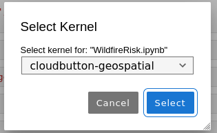

# Installation instructions

Note: These instructions are intended for use with Linux systems.

1. [Install anaconda](https://docs.anaconda.com/anaconda/install/linux/)

2. Create a new conda environment:
```
(base) $ conda create --name geospatial python=3.9
```

3. Activate geospatial environment:
```
(base) $ conda activate geospatial
```

4. Install conda dependencies:
```
(geospatial) $ conda install -c conda-forge pdal python-pdal gdal
```

5. Install python dependencies:
```
(geospatial) $ pip install -r requirements.txt
```

6. Install conda kernel for jupyter lab:
```
(geospatial) $ ipython kernel install --user --name=cloudbutton-geospatial
```

7. Start jupyter lab:
```
(geospatial) $ jupyter lab
```

8. Select the geospatial environment kernel created:



- To activate the geospatial conda environment in a new session:

```
$ source ~/anaconda3/bin/activate
(base) $ conda activate geospatial
(geospatial) $ jupyter lab
```
