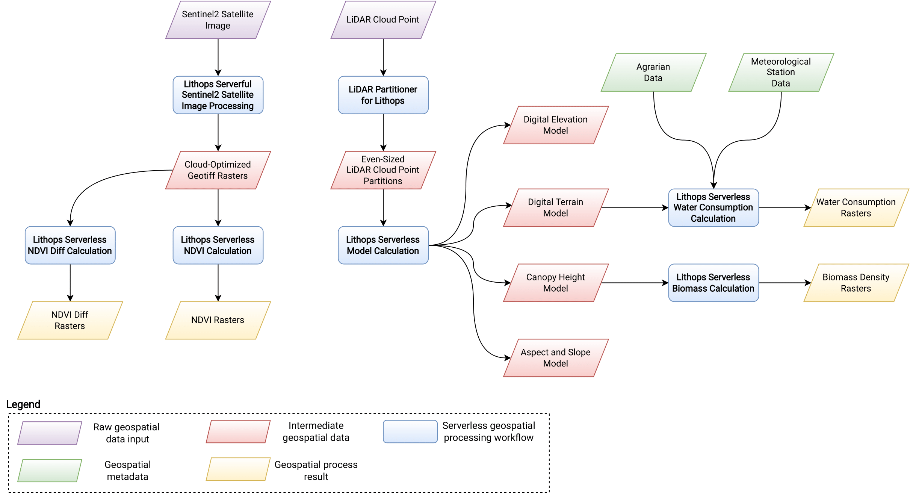

# Cloudbutton Geospatial Use Case

This repository contains the results of the geospatial use case of the [Cloudbutton project](https://cloudbutton.eu).

The workflow results are separated in multiple notebooks. Follow the instructions of each workflow README and notebook comments to reproduce the result.

All workflows utilize [Lithops](https://lithops.cloud) to easily deploy and run code on any major Cloud serverless platform.

## Notebooks

### 1. [LiDAR Partitioner](lidar-partitioner/)

A novel tool to partition LiDAR files based on the denisty of points. The partitions are simmilar in size, which is convenient for serverless processing, as task granularity defines the execution time and cost.

### 2. [Model creation from LiDAR pre-processing](calculate-models/)

LiDAR pre-processing to create several terrain models used in many geospatial workflows. We study the impact of load balancing by partitioning LiDAR data using the aforementioned density-based partitioner.

### 4. [Sentinel satellital image pre-processing](sentinel2-cog/)

Pre-processing of Sentinel2 images to enable serverless massive parallel processing with many workers consuming data from Object Storage using the Cloud-Optimized GeoTIFF format.

### 3. [NDVI Calculation](ndvi-diff/)

Use case of serverless image processing consuming data from Object Storage, NDVI is calculated over many images to demonstrate high throughput and performance.

### 4. [Crops Water Consumption Calculation](water-consumption/)

Use case of serverless geospatial data processing where the workflow requirements vary throughout the workflow steps. We demonstrate how serverless adapts and scales to the exact required resources instantly and without any management.

### 5. [Biomass Calculation](calculate-biomass/)

Use case of serverless geospatial data processing where we demonstrate how, thanks to Lithops, we can adapt a local sequential workflow to enable massive parallelism using serverless functions 

## Authors

- Josep Sampé (josep.sampe@urv.cat)
- Aitor Arjona (aitor.arjona@urv.cat)
- Sergi Domingo (sergi.domingo@urv.cat)
- Arnau Gabriel (arnau.gabriel@urv.cat)
- Sara Lanuza (sara.lanuza@urv.cat)

Former authors: Answare Tech, [Matrix Foundation](https://fundacionmatrix.es/)

